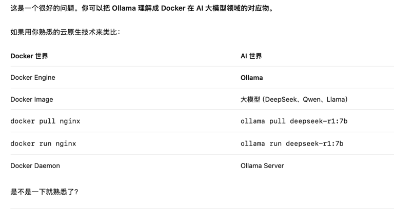

# 部署大模型
## Ollama是什么


### 本地跑DeepSeek

1. 安装ollama
```bash
brew install ollama
```
2. 启动ollama
```bash
ollama serve
```
2. 下载DeepSeek模型
```bash
ollama pull deepseek-r1:7b
```
3. 运行DeepSeek模型
```bash
ollama run deepseek-r1:7b
```

然后就可以在命令行中输入问题，DeepSeek会返回答案。

接口访问
```bash
curl http://localhost:11434/api/generate \
  -d '{
    "model":"deepseek-r1:7b",
    "prompt":"Hello"
  }'
```


