~~下面以把 https://github.com/jiangchengyu998/demo.git 部署到服务器为例
使用 tag=v2.0.0 来测试
目标服务器上要安装有docker  docker-compose。

### 构建完成后，通过ssh把jar 推送到目标服务器使用docker 启动
#### 安装插件
  - Git Parameter
  - Publish Over SSH
  - SonarQube Scanner for Jenkins

#### 全局工具配置
配置jdk
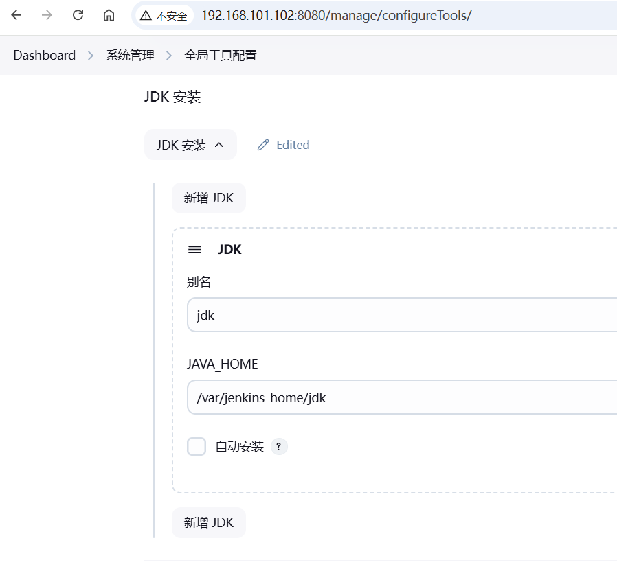

配置maven
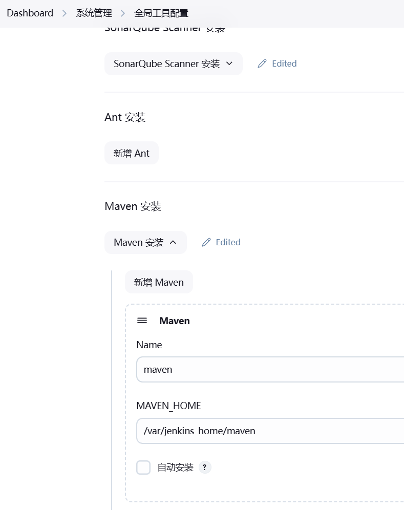

可以在setting.xml文件中配置阿里云镜像源
```xml
<mirrors>
    <mirror>
    <id>alimaven</id>
    <name>aliyun maven</name>
    <url>http://maven.aliyun.com/nexus/content/groups/public/</url>
     <mirrorOf>central</mirrorOf>
    </mirror>
  </mirrors>
```

配置sonar-scanner
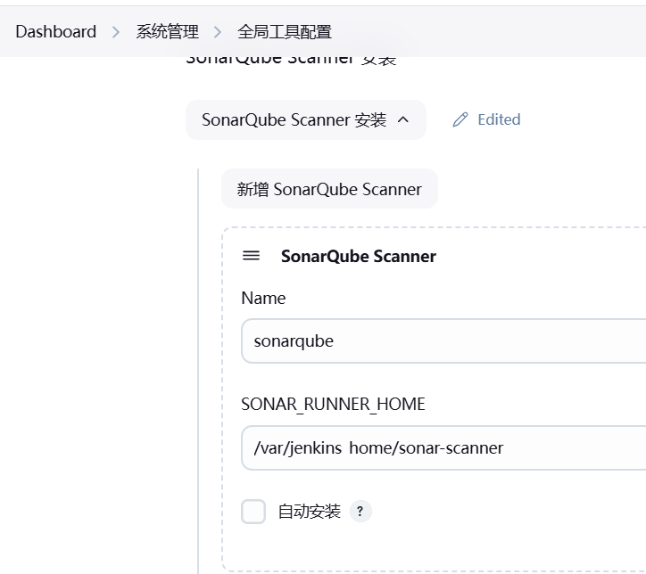

要在sonar-scanner.properties  中配置 sonar 服务器地址
```properties
sonar.host.url=http://192.168.101.102:9000
sonar.sourceEncoding=UTF-8
```

#### 系统配置
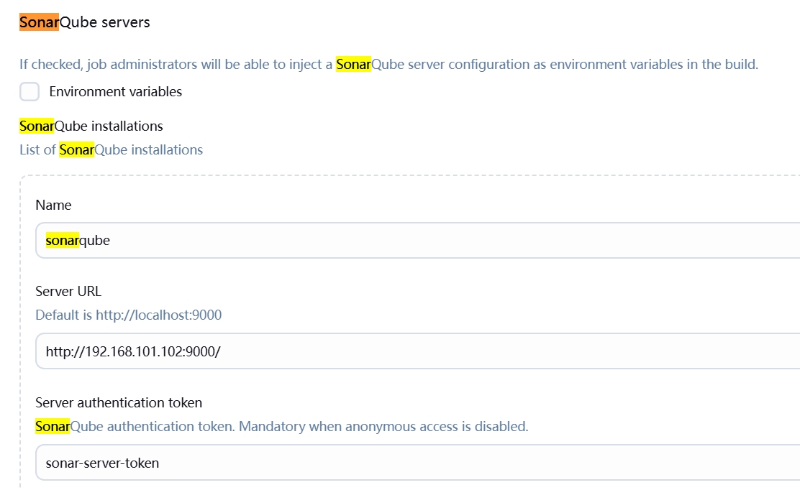

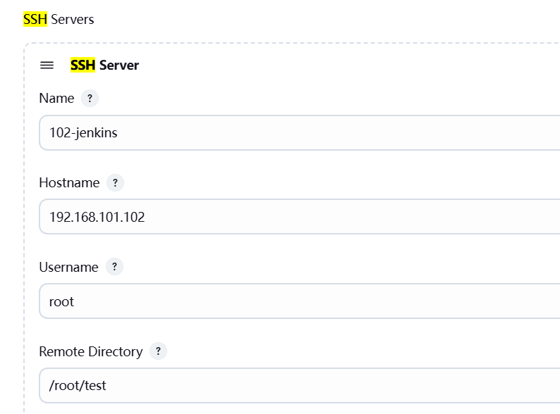

#### Job 的配置

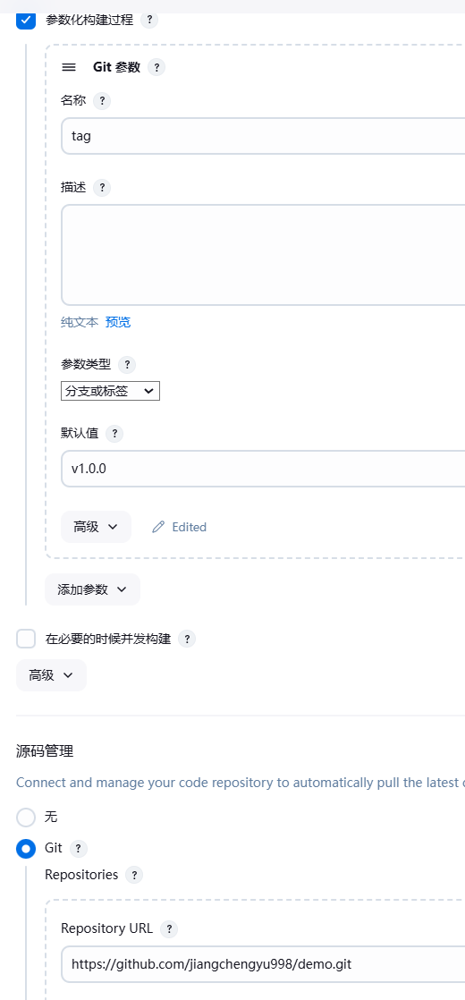
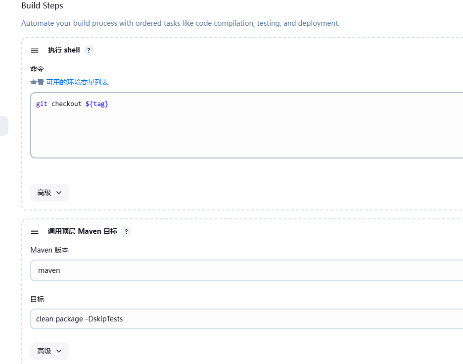
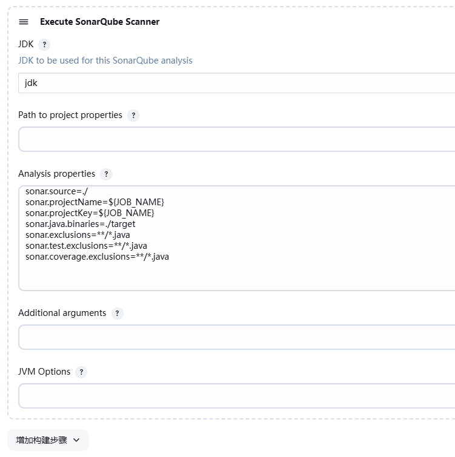
```shell
sonar.source=./ 
sonar.projectName=${JOB_NAME}
sonar.projectKey=${JOB_NAME}
sonar.java.binaries=./target
sonar.exclusions=**/*.java
sonar.test.exclusions=**/*.java
sonar.coverage.exclusions=**/*.java
```
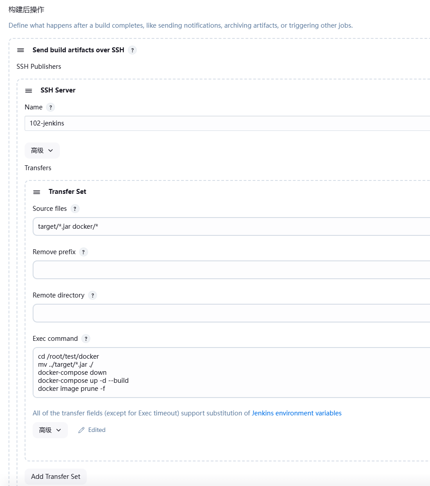
```shell
cd /root/test/docker
mv ../target/*.jar ./
docker-compose down
docker-compose up -d --build
docker image prune -f
```

### 构建完成后，制作成镜像，推送到harbor，然后ssh到目标服务器启动
#### 安装harbor


修改 harbor.yml
关闭 https
默认密码 admin/Harbor12345

```shell
cd /usr/local/harbor
./install.sh
```

然后在docker中添加配置
```json
{
  "insecure-registries": ["192.168.101.102:80"]
}
```
```shell
docker login -u admin -p Harbor12345 192.168.101.102:80
docker tag mytest:v1.0.0 192.168.101.102:80/repo/mytest:v1.0.0
docker push 192.168.101.102:80/repo/mytest:v1.0.0
docker pull 192.168.101.102:80/repo/mytest:v1.0.0
```

#### 在Jenkins 容器内使用 docker
修改docker.sock 的用户组和权限
```shell
chown root:root /var/run/docker.sock
chmod o+rw /var/run/docker.sock
```

修改 docker-compose.yaml
```yaml
services:
  jenkins:
    image: jenkins/jenkins
    container_name: jenkins
    restart: always
    environment:
      - HTTP_PROXY=http://192.168.101.51:7890
      - HTTPS_PROXY=http://192.168.101.51:7890
      - NO_PROXY=localhost,127.0.0.1,192.168.101.0/24
    ports:
      - 8080:8080
      - 50000:50000
    volumes:
      - ./data/:/var/jenkins_home/
      - /var/run/docker.sock:/var/run/docker.sock
      - /usr/bin/docker:/usr/bin/docker
      - /etc/docker/daemon.json:/etc/docker/daemon.json
```

从新启动Jenkins 容器就可以在Jenkins 中使用 docker 命令了

#### Job 配置
去掉原来的构建后操作，然后在增加推送image的命令
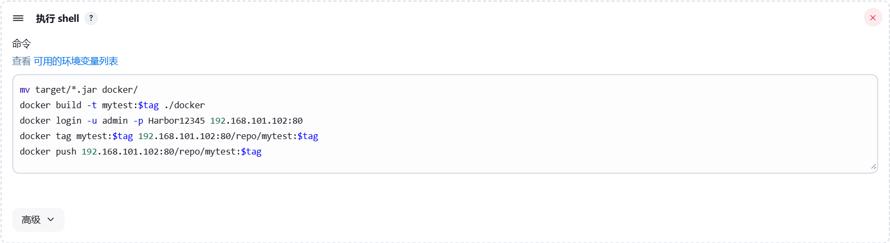

```shell
mv target/*.jar docker/
docker build -t mytest:$tag ./docker
docker login -u admin -p Harbor12345 192.168.101.102:80
docker tag mytest:$tag 192.168.101.102:80/repo/mytest:$tag
docker push 192.168.101.102:80/repo/mytest:$tag
```

#### 目标服务器准备文件
deploy.sh
```shell
#!/bin/bash
harbor_url=$1
harbor_project_name=$2
project_name=$3
tag=$4
container_port=$5
host_port=$6

imageName=$harbor_url/$harbor_project_name/$project_name:$tag
containerId=`docker ps -a | grep ${project_name} | awk '{print $1}'`
if [ "$containerId" != "" ] ; then
    docker stop $containerId
    docker rm $containerId
    echo "Delete Container Success"
fi

imageId=`docker images | grep ${project_name} | awk '{print $3}'`
if [ "$imageId" != "" ] ; then
    docker rmi -f $imageId
    echo "Delete Image Success"
fi

docker login -u admin -p Harbor12345 $harbor_url
docker pull $imageName
docker run -d -p $host_port:$container_port --name $project_name $imageName
echo "Start Container Success"
echo $project_name

```

为了让这个脚本在哪里都可以执行，把他加权限，并且移动到/usr/bin目录下面
```shell
chmod +x deploy.sh
mv deploy.sh /usr/bin
```

#### Job 配置
两个参数
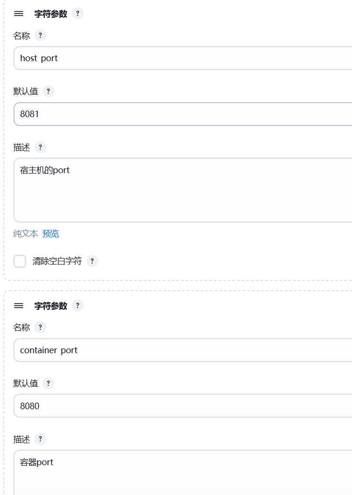
构建后操作
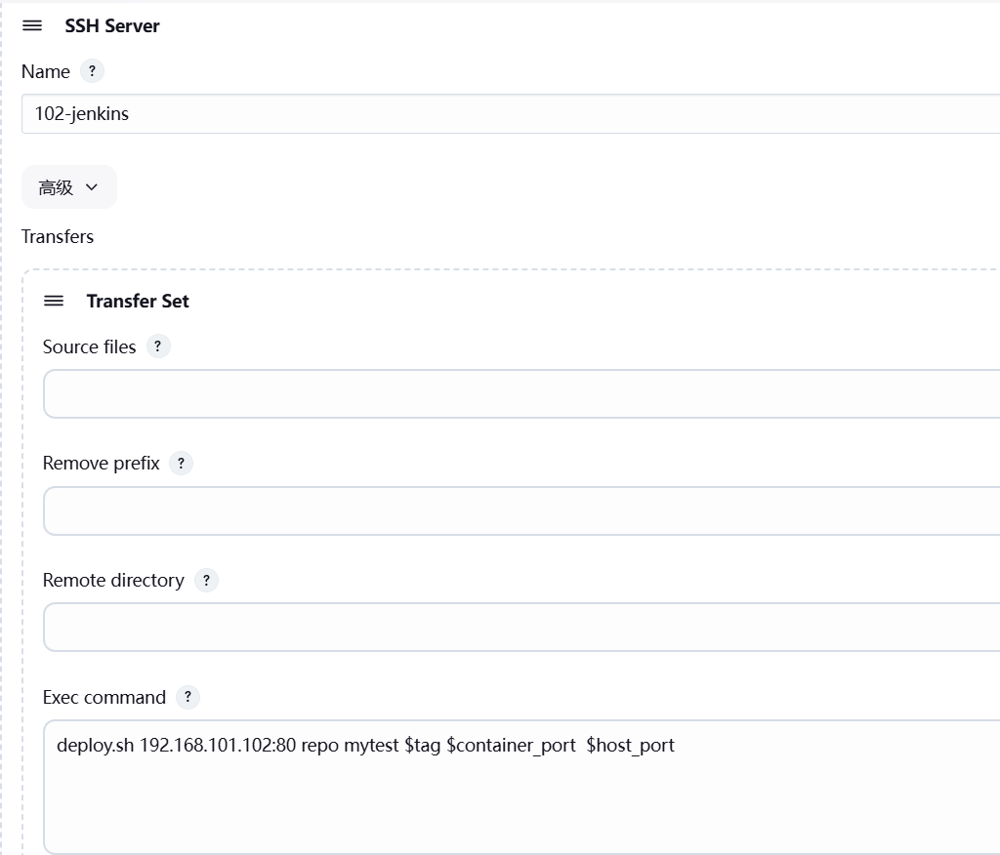
```shell
deploy.sh 192.168.101.102:80 repo mytest $tag $container_port  $host_port 
```
