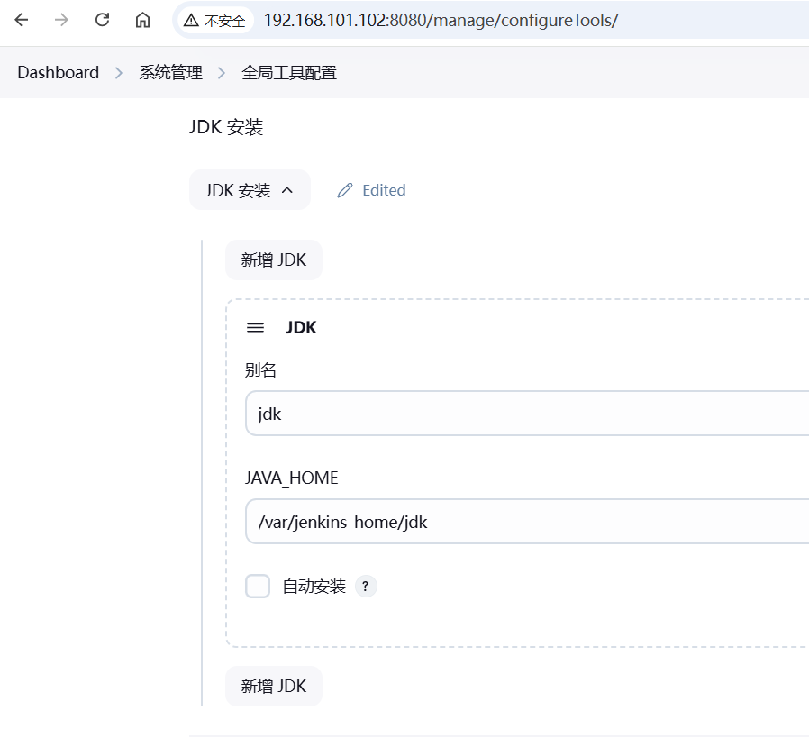
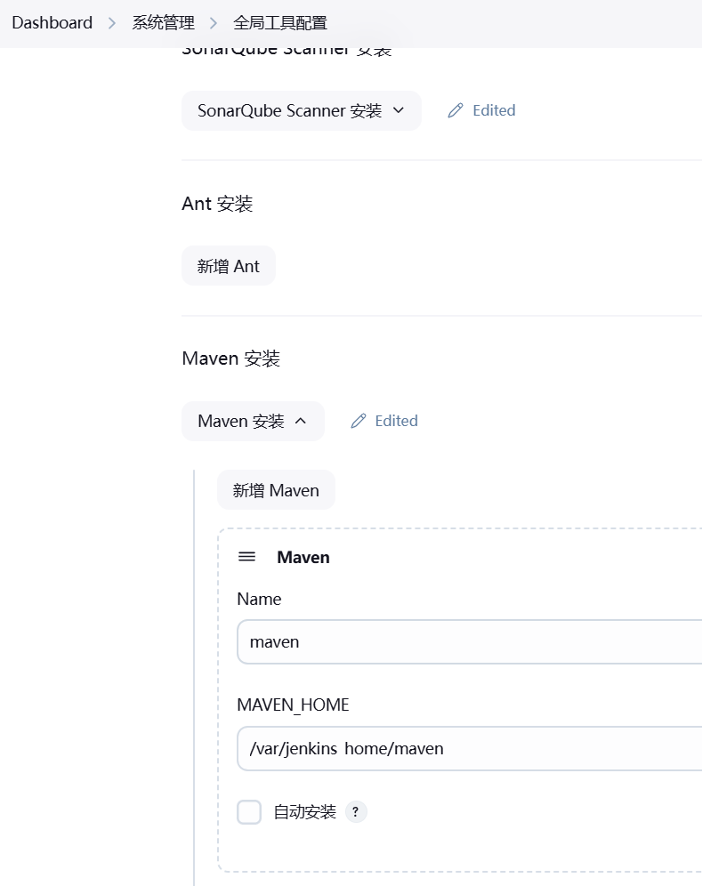
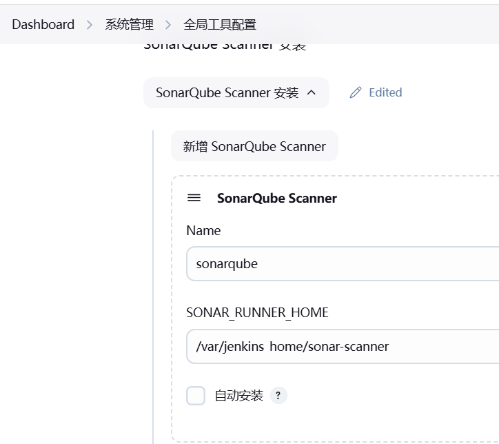
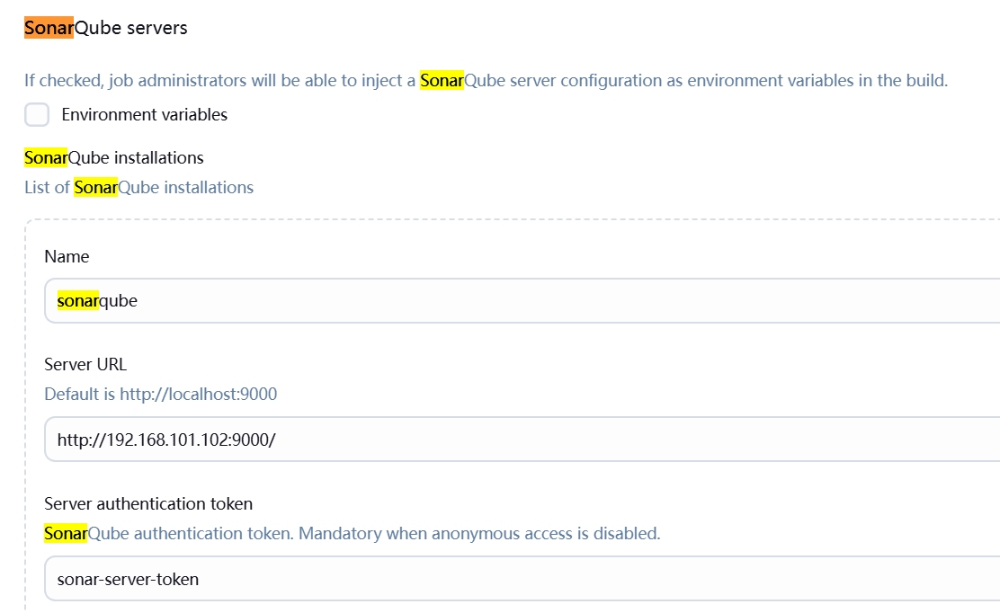
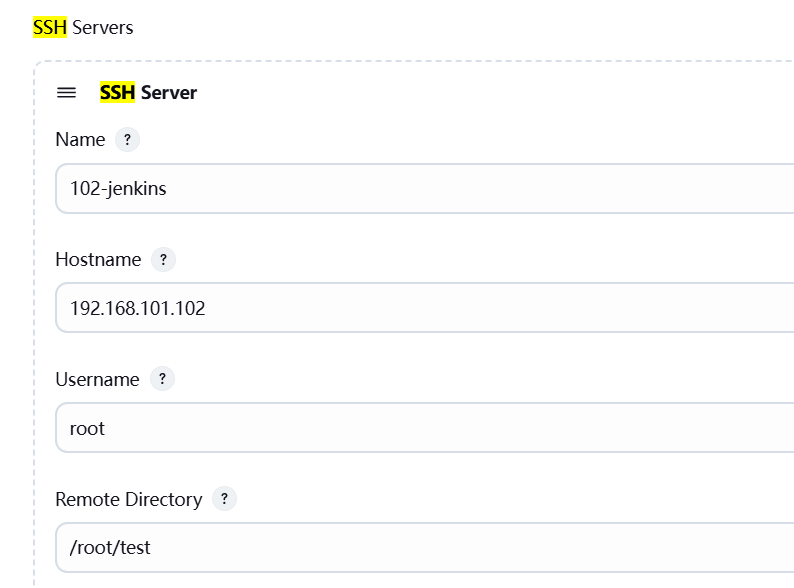
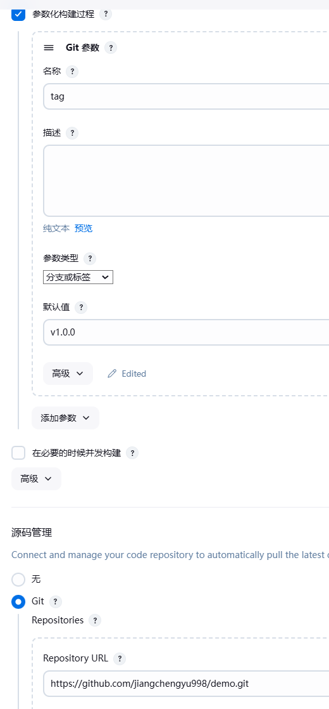
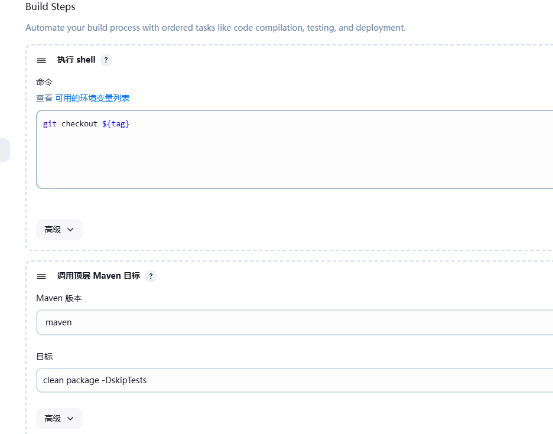
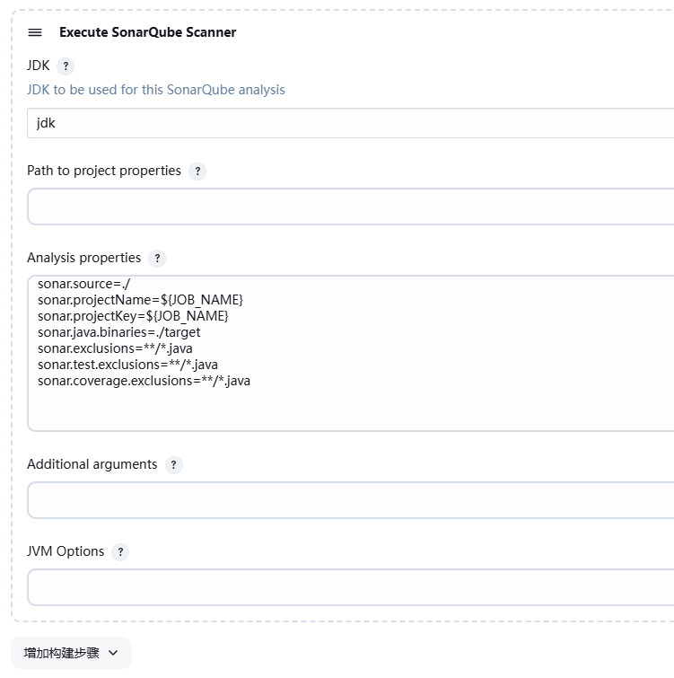
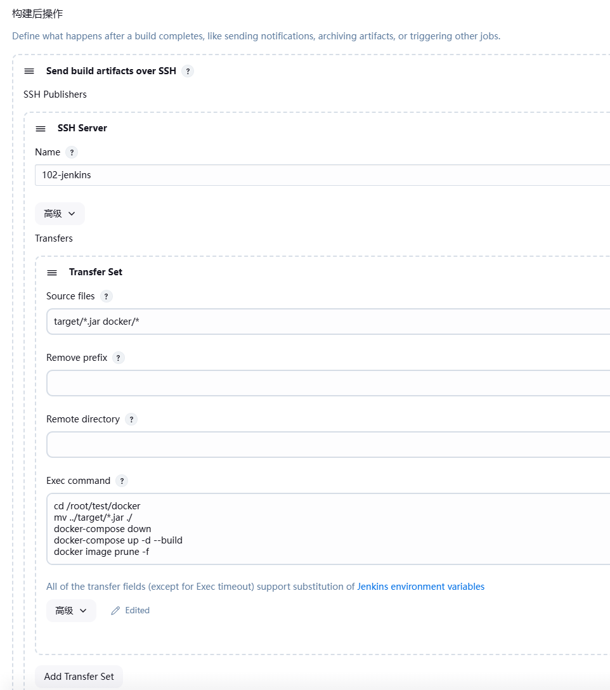

下面以把 https://github.com/jiangchengyu998/demo.git 部署到服务器为例
使用 tag=v2.0.0 来测试
目标服务器上要安装有docker  docker-compose。

### 构建完成后，通过ssh把jar 推送到目标服务器使用docker 启动
#### 安装插件
  - Git Parameter
  - Publish Over SSH
  - SonarQube Scanner for Jenkins

#### 全局工具配置
配置jdk


配置maven


可以在setting.xml文件中配置阿里云镜像源
```xml
<mirrors>
    <mirror>
    <id>alimaven</id>
    <name>aliyun maven</name>
    <url>http://maven.aliyun.com/nexus/content/groups/public/</url>
     <mirrorOf>central</mirrorOf>
    </mirror>
  </mirrors>
```

配置sonar-scanner


要在sonar-scanner.properties  中配置 sonar 服务器地址
```properties
sonar.host.url=http://192.168.101.102:9000
sonar.sourceEncoding=UTF-8
```

#### 系统配置




#### Job 的配置




```shell
sonar.source=./ 
sonar.projectName=${JOB_NAME}
sonar.projectKey=${JOB_NAME}
sonar.java.binaries=./target
sonar.exclusions=**/*.java
sonar.test.exclusions=**/*.java
sonar.coverage.exclusions=**/*.java
```

```shell
cd /root/test/docker
mv ../target/*.jar ./
docker-compose down
docker-compose up -d --build
docker image prune -f
```

### 构建完成后，制作成镜像，推送到harbor，然后ssh到目标服务器启动
#### 安装harbor
修改 harbor.yml
关闭 https
默认密码 admin/Harbor12345
然后在docker中添加配置
```json
{
  "insecure-registries": ["192.168.101.102:80"]
}
```
```shell
docker login -u admin -p Harbor12345 192.168.101.102:80
docker tag mytest:v1.0.0 192.168.101.102:80/repo/mytest:v1.0.0
docker push 192.168.101.102:80/repo/mytest:v1.0.0
docker pull 192.168.101.102:80/repo/mytest:v1.0.0
```

#### 在Jenkins 容器内使用 docker


